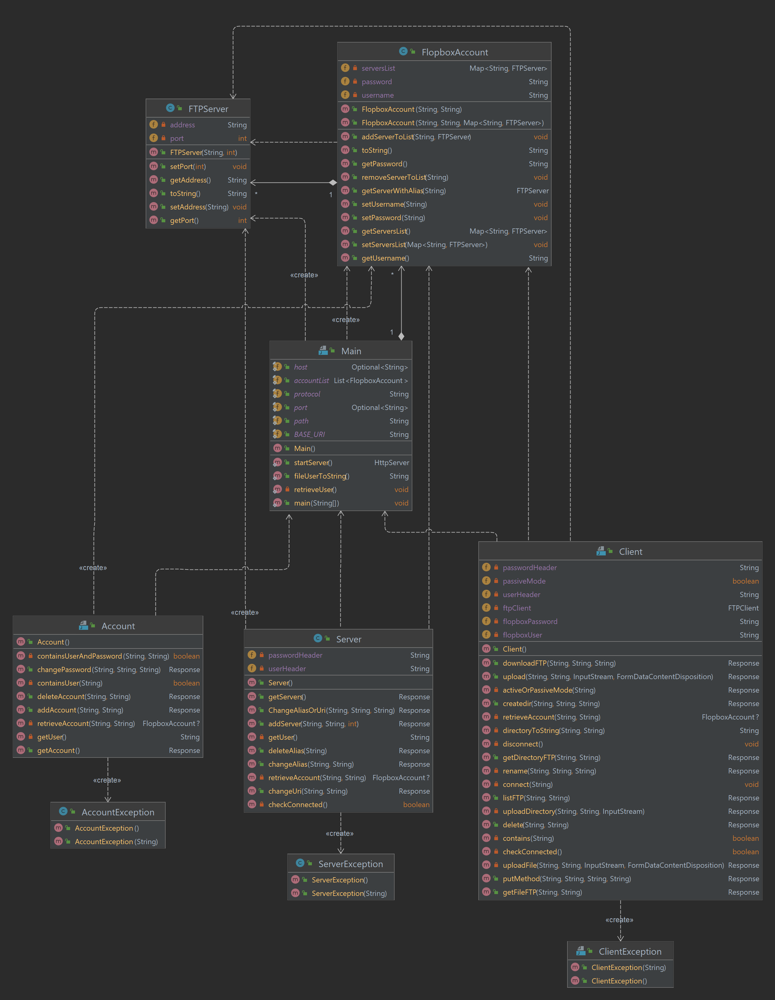

# FlopBox-POCHET

**Auteur :** Antoine Pochet, antoine.pochet.etu@univ-lille.fr <br>
**Date de début :** 28/02/22 <br>
[Vidéo du projet](doc/video.mp4)

## Presentation du projet : 

**Flopbox** est un programme codé en Java adoptant le style architectural [REST](https://fr.wikipedia.org/wiki/Representational_state_transfer) permettant de centraliser la gestion de fichiers distants stockés dans des différents serveurs FTP. La plate-forme permet la connexion de différents utilisateurs et de garder enregistrés les serveurs FTP auxquels on veut accéder rapidement sous un alias.  

## Utilisation :
### Pour générer la javadoc :
* Chemin de la javadoc une fois générée : `target/docs/*`
```
mvn javadoc:javadoc
```

### Pour générer le JAR :
```
mvn clean compile package
```

### Pour exécuter le JAR :
```
java -cp target/Flopbox-POCHET-1.0-SNAPSHOT.jar fil.sr2.Main
```

## API Endpoint
La documentation Swagger est disponible [ici](doc/swagger.yaml)
### /flopbox/account/

**Afficher les comptes :**
```
curl --location --request GET 'http://localhost:8080/flopbox/account'
```

**Ajouter un nouvel utilisateur :**
* _USERNAME_ : Nom d'utilisateur à ajouter
* _PASSWORD_ : Mot de passe de l'utilisateur à ajouter
```
curl --location --request POST 'http://localhost:8080/flopbox/account' \
--header 'username: {USERNAME}' \
--header 'password: {PASSWORD}'
```

**Supprimer un utilisateur :**
* _USERNAME_ : Nom d'utilisateur à supprimer
* _PASSWORD_ : Mot de passe de l'utilisateur à supprimer
```
curl --location --request DELETE 'http://localhost:8080/flopbox/account' \
--header 'username: {USERNAME}' \
--header 'password: {PASSWORD}'
```

**Supprimer un utilisateur :**
* _USERNAME_ : Nom d'utilisateur qui souhaite changer de mot de passe
* _PASSWORD_ : Mot de passe de l'utilisateur qui souhaite changer de mot de passe
* _NEW_PASSWORD_ : Nouveau mot de passe de l'utilisateur
```
curl --location --request PUT 'http://localhost:8080/flopbox/account' \
--header 'username: {USERNAME}' \
--header 'password: {PASSWORD}' \
--header 'newpassword: {NEW_PASSWORD}'
```

---

### /flopbox/server/

**Afficher les serveurs d'un utilisateur :**
* _USERNAME_ : Nom d'utilisateur Flopbox
* _PASSWORD_ : Mot de passe de l'utilisateur Flopbox
```
curl --location --request GET 'http://localhost:8080/flopbox/server/{USERNAME}' \
--header 'password: {PASSWORD}'
```

**Ajouter un serveur FTP :**
* _USERNAME_ : Nom d'utilisateur Flopbox
* _PASSWORD_ : Mot de passe de l'utilisateur Flopbox
* _ALIAS_ : Alias du serveur FTP
* _ADDRESS_ : URI du serveur FTP
* _PORT_ : Port du serveur FTP
```
curl --location --request POST 'http://localhost:8080/flopbox/server/{USERNAME}?aliasName={ALIAS}' \
--header 'password: {PASSWORD}' \
--header 'address: {ADDRESS}' \
--header 'port: {PORT}'
```

**Supprimer un serveur FTP :**
* _USERNAME_ : Nom d'utilisateur Flopbox
* _PASSWORD_ : Mot de passe de l'utilisateur Flopbox
* _ALIAS_ : Alias du serveur FTP
```
curl --location --request DELETE 'http://localhost:8080/flopbox/server/{USERNAME}?alias={ALIAS}' \
--header 'password: {PASSWORD}'
```

**Changer l'URI d'un serveur FTP :**
* _USERNAME_ : Nom d'utilisateur Flopbox
* _PASSWORD_ : Mot de passe de l'utilisateur Flopbox
* _ALIAS_ : Alias du serveur FTP
* _NEW_URI_ : Nouvel URI du serveur FTP
```
curl --location --request PUT 'http://localhost:8080/flopbox/server/{USERNAME}?alias={ALIAS}&newUri={NEW_URI}' \
--header 'password: {PASSWORD}'
```

**Changer l'alias d'un serveur FTP :**
* _USERNAME_ : Nom d'utilisateur Flopbox
* _PASSWORD_ : Mot de passe de l'utilisateur Flopbox
* _ALIAS_ : Alias du serveur FTP
* _NEW_ALIAS_ : Nouvel alias du serveur FTP
```
curl --location --request PUT 'http://localhost:8080/flopbox/server/{USERNAME}?alias={ALIAS}&newAlias={NEW_ALIAS}' \
--header 'password: {PASSWORD}'
```

---

### /flopbox/client/

**Lister les fichiers d'un serveur FTP :**
* _USERNAME_FLOPBOX_ : Nom d'utilisateur Flopbox
* _PASSWORD_FLOPBOX_ : Mot de passe de l'utilisateur Flopbox
* _ALIAS_ : Alias du serveur FTP
* _PATH_ : Chemin du serveur FTP à lister
* _USERNAME_FTP_ : Nom d'utilisateur du serveur FTP
* _PASSWORD_FTP_ : Mot de passe du serveur FTP
```
curl --location --request GET 'http://localhost:8080/flopbox/client/{USERNAME_FLOPBOX}?alias={ALIAS}&path={PATH}' \
--header 'username: {USERNAME_FTP}' \
--header 'password: {PASSWORD_FTP}' \
--header 'flopboxPassword: {PASSWORD_FLOPBOX}'
```

**Supprimer un fichier ou un dossier d'un serveur FTP :**
* _USERNAME_FLOPBOX_ : Nom d'utilisateur Flopbox
* _PASSWORD_FLOPBOX_ : Mot de passe de l'utilisateur Flopbox
* _ALIAS_ : Alias du serveur FTP
* _PATH_ : Chemin du serveur FTP à supprimer
* _USERNAME_FTP_ : Nom d'utilisateur du serveur FTP
* _PASSWORD_FTP_ : Mot de passe du serveur FTP
```
curl --location --request DELETE 'http://localhost:8080/flopbox/client/{USERNAME_FLOPBOX}?alias={ALIAS}&path={PATH}' \
--header 'username: {USERNAME_FTP}' \
--header 'password: {PASSWORD_FTP}' \
--header 'flopboxPassword: {PASSWORD_FLOPBOX}'
```

**Renommer un fichier ou un dossier d'un serveur FTP :**
* _USERNAME_FLOPBOX_ : Nom d'utilisateur Flopbox
* _PASSWORD_FLOPBOX_ : Mot de passe de l'utilisateur Flopbox
* _ALIAS_ : Alias du serveur FTP
* _PATH_ : Chemin du serveur FTP à renommer
* _NEW_NAME_ : Nouveau nom du fichier ou du dossier
* _USERNAME_FTP_ : Nom d'utilisateur du serveur FTP
* _PASSWORD_FTP_ : Mot de passe du serveur FTP
```
curl --location --request PUT 'http://localhost:8080/flopbox/client/{USERNAME_FLOPBOX}?alias={ALIAS}&path={PATH}&newName={NEW_NAME}' \
--header 'username: {USERNAME_FTP}' \
--header 'password: {PASSWORD_FTP}' \
--header 'flopboxPassword: {PASSWORD_FLOPBOX}'
```

**Changer le mode d'un serveur FTP :**
* _USERNAME_FLOPBOX_ : Nom d'utilisateur Flopbox
* _MODE_ : Mode du serveur FTP (`passive` ou `active`)
```
curl --location --request PUT 'http://localhost:8080/flopbox/client/{USERNAME_FLOPBOX}?mode={MODE}'
```

**Créer un dossier sur un serveur FTP :**
* _USERNAME_FLOPBOX_ : Nom d'utilisateur Flopbox
* _PASSWORD_FLOPBOX_ : Mot de passe de l'utilisateur Flopbox
* _ALIAS_ : Alias du serveur FTP
* _PATH_ : Chemin du serveur FTP à renommer
* _DIRECTORY_NAME_ : Nouveau nom du fichier ou du dossier
* _USERNAME_FTP_ : Nom d'utilisateur du serveur FTP
* _PASSWORD_FTP_ : Mot de passe du serveur FTP
```
curl --location --request POST 'http://localhost:8080/flopbox/client/{USERNAME_FLOPBOX}?alias={ALIAS}&path={PATH}&directoryName={DIRECTORY_NAME}' \
--header 'username: {USERNAME_FTP}' \
--header 'password: {PASSWORD_FTP}' \
--header 'flopboxPassword: {PASSWORD_FLOPBOX}'
```

**Télécharger un fichier d'un serveur FTP :**
* _USERNAME_FLOPBOX_ : Nom d'utilisateur Flopbox
* _PASSWORD_FLOPBOX_ : Mot de passe de l'utilisateur Flopbox
* _ALIAS_ : Alias du serveur FTP
* _PATH_ : Chemin du fichier du serveur FTP à télécharger
* _USERNAME_FTP_ : Nom d'utilisateur du serveur FTP
* _PASSWORD_FTP_ : Mot de passe du serveur FTP
```
curl --location --request GET 'http://localhost:8080/flopbox/client/{USERNAME_FLOPBOX}/download?alias={ALIAS}&filePath={PATH}' \
--header 'username: {USERNAME_FTP}' \
--header 'password: {PASSWORD_FTP}' \
--header 'flopboxPassword: {PASSWORD_FLOPBOX}'
```

**Télécharger un dossier d'un serveur FTP :**
* _USERNAME_FLOPBOX_ : Nom d'utilisateur Flopbox
* _PASSWORD_FLOPBOX_ : Mot de passe de l'utilisateur Flopbox
* _ALIAS_ : Alias du serveur FTP
* _PATH_ : Chemin du dossier du serveur FTP à télécharger
* _USERNAME_FTP_ : Nom d'utilisateur du serveur FTP
* _PASSWORD_FTP_ : Mot de passe du serveur FTP
```
curl --location --request GET 'http://localhost:8080/flopbox/client/{USERNAME_FLOPBOX}/download?alias={ALIAS}&directoryPath={PATH}' \
--header 'username: {USERNAME_FTP}' \
--header 'password: {PASSWORD_FTP}' \
--header 'flopboxPassword: {PASSWORD_FLOPBOX}'
```

**Envoyer un dossier ou un fichier vers un serveur FTP :**
* _USERNAME_FLOPBOX_ : Nom d'utilisateur Flopbox
* _PASSWORD_FLOPBOX_ : Mot de passe de l'utilisateur Flopbox
* _ALIAS_ : Alias du serveur FTP
* _PATH_ : Destination du fichier ou du dossier du serveur FTP
* _USERNAME_FTP_ : Nom d'utilisateur du serveur FTP
* _PASSWORD_FTP_ : Mot de passe du serveur FTP
* _FILE_PATH_ : Chemin du fichier ou du dossier à envoyer vers le serveur FTP
```
curl --location --request POST 'http://localhost:8080/flopbox/client/{USERNAME_FLOPBOX}?alias={ALIAS}&path={PATH}' \
--header 'username: {USERNAME_FTP}' \
--header 'password: {PASSWORD_FTP}' \
--header 'flopboxPassword: {PASSWORD_FLOPBOX}'
--form 'file=@"{FILE_PATH}"'
```

## Architecture
*UML du projet :* <br> 


### Lister et expliquer la gestion d'erreur :

Dans ce projet, il y a plusieurs Classes qui extends Exception. <br>
* `AccountException` : permet de relever les exceptions pour la classe "Account" pour les comptes Flopbox <br>
* `ClientException` : permet de relever les exceptions pour la classe "Client" pour les commandes éxécutés au serveur FTP par un utilisateur Flopbox <br>
* `ServerException` : permet de relever les exceptions pour la classe "Server" pour les serveurs FTP <br>

## Code samples :

On peut voir ici la méthode pour récupérer le fichier "user.json" et transformer son contenu en String pour pouvoir recréer l'architecture de notre fichier avec des JSONObject plus tard.

```
public static String fileUserToString() {
  StringBuilder fileres = new StringBuilder();
  
  // On essaye de lire le fichier
  try (BufferedReader br = new BufferedReader(new FileReader("resources/user.json"))) {
    String line = "";
    //Tant que l'on lit quelque chose on ajoute la ligne au résultat
    do {
      line = br.readLine();
      fileres.append(line);
    } while (line != null);
  } catch (IOException e) {
    e.printStackTrace();
  }
  return fileres.toString();
}
```

On peut voir ici la partie où, une fois le serveur lancé, on récupère toutes les informations contenues de notre fichier "user.json" qui contient les informations des utilisateurs de la plate-forme Flopbox.

```
private static void retrieveUser() {
  // On récupère le fichier sous forme de String
  String fileres = fileUserToString();

  try {
    // On créer un JSONObject pour redéfinir notre fichier et recréer l'architecture de notre fichier
    JSONObject file = new JSONObject(fileres);
    [...]
    
    // On parcours notre JSONObject
    while (keys.hasNext()) {
    
      String key = keys.next();
      if (file.get(key) instanceof JSONObject) {
        // On récupère les informations de l'utilisateur pour créer un FlopboxAccount 
        JSONObject utilisateur = (JSONObject) file.get(key);
        FlopboxAccount usertoadd = new FlopboxAccount(key, utilisateur.getString("password"));
        
        [...]
        
        // Si l'utilisateur as des serveur enregistrée
        if (containsServerlist.contains("serverlist")) {
          // Alors on les récupère et on ajoute dans une map avec comme key l'alias et comme value un FTPServer
          Map<String, FTPServer> listofserver = new HashMap<>();
          JSONObject serverlist = (JSONObject) utilisateur.get("serverlist");

          for (int i = 0; i < serverlist.names().length(); i++) {
            // Récupèration des informations du FTPServer
            [...]
            //Ajout du serveur dans la map
            listofserver.put(alias, new FTPServer(address, portInt));
          }
          //Ajout de la map pour l'utilisateur 
          usertoadd.setServersList(listofserver);
        }
        // Ajout de l'utilisateur dans la liste des comptes de la plate-forme
        accountList.add(usertoadd);
      }
    }
  } catch (JSONException e) {
    throw new RuntimeException(e);
  }
}
```

La méthode suivante permet d'ajouter un serveur pour un utilisateur et de mettre à jour le fichier "user.json".

```
public Response addServer(@QueryParam("aliasName") String aliasName, @HeaderParam("address") String address, @HeaderParam("port") int port) {
  // Si l'utilisateur est connecté on peut continuer le traitement 
  if (checkConnected())
    return Response.status(Response.Status.UNAUTHORIZED).entity("Authentification incorrect!").build();

  // Si l'alias du serveur que l'on veut ajouter n'est pas encore présent alors on peut continuer le traitement 
  if (Objects.requireNonNull(retrieveAccount(userHeader, passwordHeader)).getServersList().containsKey(aliasName))
    return Response.status(Response.Status.CONFLICT).entity("Alias déjà existant!").build();

  try {
    //On récupère le fichier "user.json" sous forme de String
    JSONObject file = new JSONObject(getUser());

    [...]
    
    // On ajout le serveur à la map de l'utilisateur en question
    serverlist.put(aliasName, new FTPServer(address, port));
    account.put("serverlist", serverlist);
    
    // On écrit dans notre fichier pour enregistrer le serveur
    PrintWriter out = new PrintWriter("resources/user.json");
    [...]
    
    return Response.status(Response.Status.OK).entity("Nouveau serveur ajouté sous l'alias : " + aliasName).build();

  } catch (IOException | JSONException e) {
    throw new ServerException("Erreur lors de l'ajout du serveur FTP sur la plate-forme Flopbox : " + e.getMessage());
  }
}
```

Cette méthode permet, lors d'une demande de téléchargement d'un dossier, de le lister à l'utilisateur pour que par la suite, il effectue des request pour télécharger les fichiers 

```
private String directoryToString(String path, String tabulation) {
  StringBuilder resfiles = new StringBuilder();
  try {
    // On liste le contenu du chemin passer en paramètre
    FTPFile[] files = ftpClient.listFiles(path);
    
    for (FTPFile filelist : files) {
      // Si c'est un répertoire on ajoute une tabulation pour que l'utilisateur est un affichage compréhensible et on refait appel à la méthode récursivement
      if (filelist.isDirectory()) {
        resfiles.append(tabulation).append(filelist.getName()).append("/").append("\n");
        tabulation += "\t";
        resfiles.append(directoryToString(path + "/" + filelist.getName(), tabulation));
      // Sinon on ajoute le nom du fichier au résultat final
      } else {
        resfiles.append(tabulation).append(filelist.getName()).append("\n");
      }
    }
  } catch (IOException e) {
    throw new ClientException("Erreur lors de la récupération des fichiers sur le serveur FTP : " + e.getMessage());
  }

  return resfiles.toString();
}
```

Cette méthode permet à l'utilisateur d'éffectuer l'envoie d'un répertoire vers un serveur FTP. Le fichier d'entrée est un ZIP et cette méthode permet de désarchiver ce fichier pour éffectuer l'envoie vers le serveur FTP de son contenu.

```
private Response uploadDirectory(String alias, String path, InputStream uploadedInputStream) {
  try {
    // On se connecte au serveur FTP
    connect(alias);
    
    // On créer un fichier temporaire
    File file = Files.createTempFile("output","zip").toFile();
    OutputStream outputStream = new FileOutputStream(file);
    
    // Lecture du fichier pour écrire dans l'OuputStream 
    [..]
    
    ZipFile zipFile = new ZipFile(file);
    Enumeration<? extends ZipEntry> zipEntries = zipFile.entries();
    
    // On parcours notre fichier temporaire contenant les élements du fichier ZIP en paramètre
    while (zipEntries.hasMoreElements()) {
      [...]
      
      // Si un des éléments est un répetoire on éffectue une création de répertoire
      if (zipEntry.isDirectory()) ftpClient.makeDirectory(path + "/" + zipEntry.getName());
      // Sinon on envoie le fichier via la méthode storeFile vers le serveur FTP
      else ftpClient.storeFile(path + "/" + zipEntry.getName(), inputStream);
    }
    
    disconnect();
    return Response.status(Response.Status.OK).entity("Upload du dossier effectué\n").build();

  } catch (IOException e) {
    throw new ClientException("Erreur lors de l'envoie du dossier sur le serveur FTP : " + e.getMessage());
  }
}
```
